# UX Design Specification - SubTrack

**Author:** GOZE
**Date:** 2026-01-29

---

## Executive Summary

### Project Vision

**SubTrack** is a cross-platform mobile application designed to rescue users from "subscription hell." The average consumer manages 12+ active subscriptions, spending approximately €273/month—often 3x more than they realize.

**Core Value Proposition:** Empower users to take control of their subscriptions through manual tracking and smart reminders, enabling conscious spending decisions.

**Target Market:** Europe (GDPR/PSD2 compliant)
**Business Model:** Freemium (5 free subscriptions → €2.99/month premium)
**MVP Language:** English

### Target Users

#### Primary Persona: Elif (28) - Young Professional

- **Context:** Works at a digital agency, good salary but unclear where it goes
- **Tech Level:** Intermediate, iPhone user, comfortable with apps
- **Pain Point:** End-of-month "did I spend this much?" shock
- **Goal:** Take control, identify unnecessary subscriptions
- **Usage Pattern:** Quick checks during tired moments, needs immediate value

#### Secondary Persona: Mehmet (47) - Family Father

- **Context:** Father of 2, manages family's digital subscriptions
- **Tech Level:** Intermediate, Android user, prefers simple apps
- **Pain Point:** Can't track trials started by kids, billing surprises
- **Goal:** Control family budget, prevent unwanted charges
- **Usage Pattern:** Periodic review, needs simplicity over features

### Key Design Challenges

| Challenge                      | Impact                                                      | UX Strategy                                                                  |
| ------------------------------ | ----------------------------------------------------------- | ---------------------------------------------------------------------------- |
| **Manual Entry Fatigue**       | Users may abandon if adding 12+ subscriptions feels tedious | Smart suggestions, quick-entry forms, progressive disclosure                 |
| **First Value Delivery**       | Users are impatient, need immediate value demonstration     | "AHA moment" within 2 minutes of signup                                      |
| **Notification Trust**         | Users must trust that reminders will actually work          | Visible status indicators, test notification option, missed reminder history |
| **Cross-Platform Consistency** | iOS and Android users expect same quality experience        | Unified design system, shared components                                     |
| **Freemium Conversion**        | 5-subscription limit shouldn't feel punishing               | Soft upsell, clear value demonstration before paywall                        |

### Design Opportunities

| Opportunity               | Competitive Advantage                                                        |
| ------------------------- | ---------------------------------------------------------------------------- |
| **Emotional Design**      | Create shock value with spending visualizations ("€189/month = €2,268/year") |
| **Micro-interactions**    | Celebration animations when subscription cancelled (positive reinforcement)  |
| **Smart Home Screen**     | Adaptive content - show upcoming renewals when urgent, dashboard otherwise   |
| **Contextual Onboarding** | Teach features while user adds first subscription (learning by doing)        |
| **Trial Protection**      | Highly visible trial countdown - Mehmet's primary value driver               |

### UX Design Principles (Derived)

1. **Simplicity First** - Mehmet must understand every screen without help
2. **Immediate Value** - Elif needs her "AHA moment" in under 2 minutes
3. **Trust Through Transparency** - Notification status always visible
4. **Emotional Impact** - Numbers should create conscious spending awareness
5. **Progressive Complexity** - Simple start, advanced features discoverable

### Platform & Technical Context

| Aspect                   | Decision              | UX Implication                         |
| ------------------------ | --------------------- | -------------------------------------- |
| **Framework**            | React Native          | Consistent UX across iOS/Android       |
| **Offline Mode**         | Not supported (MVP)   | Clear "no connection" messaging needed |
| **Biometric Auth**       | Face ID / Fingerprint | Quick, secure app access               |
| **Push Notifications**   | Critical feature      | Permission flow must be compelling     |
| **Calendar Integration** | Optional sync         | Non-intrusive integration prompt       |

### Phase Considerations

| Phase        | UX Focus                                                                            |
| ------------ | ----------------------------------------------------------------------------------- |
| **MVP**      | Manual entry excellence, notification reliability, "AHA moment"                     |
| **Phase 2**  | Bank integration UX, auto-detection review flow, manual vs. detected reconciliation |
| **Phase 3+** | Family sharing UX, smart suggestions, advanced analytics                            |

## Core User Experience

### Defining Experience

**Primary User Action:** Adding and managing subscriptions
**Critical Success Metric:** Seeing total spending creates the "AHA moment"
**Value Delivery:** Timely renewal reminders that prevent unwanted charges

**Core Experience Loop:**

1. Add subscription (quick, effortless)
2. See total impact (emotional, visual)
3. Receive reminder (timely, actionable)
4. Make conscious decision (cancel or keep)
5. Repeat

**The Unlock Moment:** Notification permission is the gateway to all value. Without it, SubTrack becomes a passive list instead of an active guardian.

### Platform Strategy

| Aspect                  | Decision                             | Rationale                                                 |
| ----------------------- | ------------------------------------ | --------------------------------------------------------- |
| **Platform**            | React Native (iOS 14+ / Android 10+) | Cross-platform consistency                                |
| **Primary Input**       | Touch (single-handed)                | Mobile-first, on-the-go usage                             |
| **Gesture Support**     | Swipe actions enabled                | Quick delete, edit, mark as cancelled                     |
| **Offline Mode**        | Not supported (MVP)                  | Simplifies architecture, requires clear offline messaging |
| **Critical Permission** | Push Notifications                   | Core value depends on this permission                     |

**Single-Handed Design Requirements:**

- Bottom navigation bar for primary actions
- Thumb-zone optimization for frequent interactions
- Large touch targets (minimum 44x44 points)
- Swipe gestures for quick actions on list items

### Effortless Interactions

**Design Goal:** Every interaction should require ZERO cognitive load

| Interaction          | Target                    | How to Achieve                                              |
| -------------------- | ------------------------- | ----------------------------------------------------------- |
| **Add Subscription** | < 60 seconds, 3 steps max | Smart defaults, auto-suggestions, minimal required fields   |
| **Set Reminder**     | 1 tap                     | Pre-configured defaults (3 days before), easy override      |
| **View Spending**    | Instant                   | Dashboard loads first, total always visible                 |
| **Quick Actions**    | Swipe                     | Left swipe = edit, Right swipe = delete (with confirmation) |
| **App Access**       | < 2 seconds               | Biometric authentication, no friction                       |

**Swipe Gesture Design:**

- Left swipe on subscription → Edit options
- Right swipe on subscription → Delete (with undo option)
- Pull down on list → Refresh data
- Swipe between tabs → Navigate sections

### Critical Success Moments

| Moment                       | Success State                             | Failure State                        | Design Priority |
| ---------------------------- | ----------------------------------------- | ------------------------------------ | --------------- |
| **Notification Permission**  | User understands value, grants permission | User dismisses without understanding | P0 - CRITICAL   |
| **First Subscription Added** | Completed in < 60 seconds                 | Abandoned due to complexity          | P0              |
| **AHA Moment**               | User sees total and feels impact          | Numbers feel abstract or meaningless | P0              |
| **First Reminder Received**  | Timely, actionable, prevents charge       | Missed or too late                   | P0              |
| **Freemium Limit Hit**       | User sees clear value, considers upgrade  | User feels punished, abandons app    | P1              |

**Notification Permission Flow (Critical Path):**

1. Show value proposition: "Never miss a renewal again"
2. Display social proof: "Users save €47/month on average"
3. Explain what happens: "We'll remind you 3 days before each renewal"
4. Request permission with context
5. If denied: Show persistent but non-intrusive reminder of disabled state

### Experience Principles

1. **Notification-First Design**
   - All UX decisions consider notification permission impact
   - Permission request is storytelling, not interruption
   - Disabled notification state is always visible

2. **One-Handed Mastery**
   - All critical actions reachable with thumb
   - Bottom navigation for primary sections
   - No gestures requiring two hands

3. **Swipe-to-Action**
   - List items support horizontal swipe gestures
   - Consistent gesture patterns throughout app
   - Visual hints for discoverability

4. **Zero-Friction Entry**
   - Subscription form: Name → Price → Date → Done
   - Smart suggestions reduce typing
   - Category selection optional, not blocking

5. **Instant Value Display**
   - Total monthly/yearly cost always prominent
   - Visual design creates emotional impact
   - "Shock value" through clear number presentation

6. **Permission Storytelling**
   - Never request permission without context
   - Show value before asking
   - Graceful degradation if permission denied

## Desired Emotional Response

### Primary Emotional Goals

**Core Emotional State:** Empowered Control + Safe Security

Users should feel like they are:

- **In Control:** "I know exactly what I'm paying for and when"
- **Protected:** "The app has my back, I won't miss anything"
- **Aware:** "I finally see the full picture of my spending"

**Emotional Formula:**

```
Control (I decide) + Security (App protects) = Peace of Mind
```

**Sharing Motivation:** Relief

- Users share because they want others to experience the same relief
- Key message: "I no longer have bill shock at the end of the month!"
- Social proof should emphasize relief stories, not just savings numbers

### Emotional Journey Mapping

| Stage                       | Desired Emotion             | Design Approach                      |
| --------------------------- | --------------------------- | ------------------------------------ |
| **Discovery**               | Curiosity + Hope            | "Finally, a solution to my problem"  |
| **Onboarding**              | Confidence + Ease           | "This is simple, I can do this"      |
| **First Subscription**      | Accomplishment + Excitement | Celebration micro-interaction        |
| **Seeing Total**            | Shock + Determination       | "AHA moment" with motivating visuals |
| **Receiving Reminder**      | Gratitude + Trust           | "Thank you for watching out for me"  |
| **Cancelling Subscription** | Victory + Savings Pride     | Celebration + savings visualization  |
| **Returning**               | Comfort + Habit             | "My trusted subscription guardian"   |
| **Error/Failure**           | Disappointment + Hope       | Quick path to resolution, no blame   |

### Micro-Emotions

**Critical Micro-Emotion: Trust vs. Doubt**

Trust is the foundation of SubTrack's value proposition. Without trust in notifications, the app becomes a passive list rather than an active guardian.

**Trust-Building Design Elements:**

- Notification status always visible in app header
- "Test notification" button during onboarding
- Notification delivery history accessible
- Success counter: "247 reminders delivered on time"
- Visual confirmation when reminder is scheduled

**Secondary Micro-Emotions:**

| Positive (Target) | Negative (Avoid) | Design Strategy                    |
| ----------------- | ---------------- | ---------------------------------- |
| Confidence        | Confusion        | Clear UI, obvious actions          |
| Accomplishment    | Frustration      | Quick wins, progress indicators    |
| Delight           | Boredom          | Strategic micro-interactions       |
| Trust             | Skepticism       | Transparency, proof of reliability |

### Delight Moments

**Strategic Delight Points (Not Random Joy):**

| Moment                       | Delight Type               | Implementation                            |
| ---------------------------- | -------------------------- | ----------------------------------------- |
| **First Subscription Added** | Accomplishment Celebration | Confetti animation + encouraging message  |
| **Subscription Cancelled**   | Victory Celebration        | Savings highlight + celebratory animation |
| **Milestone Reached**        | Progress Recognition       | "You've tracked 10 subscriptions!" badge  |
| **Successful Reminder**      | Trust Reinforcement        | Subtle checkmark + "We got you" message   |

**Delight Design Principles:**

- Celebrate user wins, not app features
- Show savings in relatable terms (€12.99/month = €155.88/year)
- Keep celebrations brief (1-2 seconds max)
- Allow users to skip/disable if preferred

### Emotional Design Principles

1. **Trust is the Foundation**
   - Every design decision should reinforce notification reliability
   - Transparency over mystery - show users how the system works
   - Proof over promises - display track record, not just claims

2. **Control Feels Empowering, Not Burdensome**
   - Manual entry should feel like "taking charge," not "doing work"
   - Present data as "your command center," not "your chores"
   - Actions should feel decisive, not tentative

3. **Security Without Anxiety**
   - Protection should feel supportive, not paranoid
   - Reminders are "friendly nudges," not "scary warnings"
   - Missed items are "opportunities to catch up," not "failures"

4. **Celebrate Savings, Not Spending**
   - Focus on money saved, not money spent
   - Frame cancellations as victories
   - Make the user the hero of their financial story

5. **Error Recovery Preserves Trust**
   - Acknowledge problems quickly and honestly
   - Provide clear path to resolution
   - Never blame the user, even when it's user error
   - Turn recovery into trust-building opportunity

### Emotional Anti-Patterns to Avoid

| Anti-Pattern       | Why It's Bad                              | Alternative                          |
| ------------------ | ----------------------------------------- | ------------------------------------ |
| Guilt-tripping     | "You're wasting money!" creates shame     | "Here's an opportunity to save"      |
| Fear-mongering     | Anxiety-based notifications erode trust   | Calm, informative reminders          |
| Overwhelming data  | Too many numbers cause cognitive overload | Focus on one key metric at a time    |
| Forced celebration | Annoying if overdone                      | Strategic, skippable delight moments |
| Blame on errors    | Destroys trust instantly                  | Take responsibility, offer solutions |

## UX Pattern Analysis & Inspiration

### Inspiring Products Analysis

#### Banking Apps (Financial UX Excellence)

**Key Patterns Adopted:**

| Pattern                  | Description                                  | Application                               |
| ------------------------ | -------------------------------------------- | ----------------------------------------- |
| **Instant Balance View** | Total visible immediately on app open        | Dashboard shows monthly total prominently |
| **Quick Actions Bar**    | Fixed bottom navigation for frequent actions | "Add Subscription" always accessible      |
| **Security Indicators**  | Visual trust signals throughout              | Notification status badge in header       |
| **Transaction History**  | Chronological, filterable list               | Renewal history and reminder log          |
| **Color Coding**         | Green for positive, red for negative         | Green for savings, neutral for spending   |

**Micro-interactions to Adopt:**

- Smooth number animation when totals update
- Satisfying haptic feedback on successful actions
- Subtle celebration on positive outcomes (cancellation)

#### Notion (Clean UI & Flexibility)

**Key Patterns Adopted:**

| Pattern                  | Description                                  | Application                                     |
| ------------------------ | -------------------------------------------- | ----------------------------------------------- |
| **Minimalist Interface** | Only essential elements, generous whitespace | Clean subscription list, no clutter             |
| **Card-Based Layout**    | Each item is independent, movable            | Subscription cards with consistent structure    |
| **Soft Animations**      | Transitions are fluid, non-distracting       | Screen transitions, list reordering             |
| **Empty State Design**   | Empty = opportunity, not failure             | Positive "Add your first subscription!" message |

**Visual Design Principles:**

- Neutral base colors with minimal accent
- Clear typography hierarchy
- Simple, universally understood icons

#### Apple Reminders (Notification Excellence)

**Key Patterns Adopted:**

| Pattern                     | Description                        | Application                                  |
| --------------------------- | ---------------------------------- | -------------------------------------------- |
| **Reliable Notifications**  | Always on time, never missed       | SubTrack's #1 priority                       |
| **Quick Entry**             | Text → Date → Done                 | Name → Price → Date → Done                   |
| **Smart Suggestions**       | "Tomorrow", "Next week" shortcuts  | "Monthly", "Yearly", "Quarterly" quick picks |
| **Completion Satisfaction** | Checkbox animation feels rewarding | Cancellation celebration animation           |

### Competitor Analysis

#### Bobby (iOS) - Premium Minimalism

- **Strengths:** Award-winning design, colorful customization, focused simplicity
- **Weaknesses:** iOS only, no bank integration, notification reliability complaints
- **SubTrack Opportunity:** Adopt visual appeal + cross-platform + reliable notifications

#### Truebill/Rocket Money (US) - Full Service

- **Strengths:** Auto bank integration, cancellation service, negotiation bot
- **Weaknesses:** US-focused, complex, aggressive freemium
- **SubTrack Opportunity:** Europe/PSD2 focus, stay simple, soft upsell approach

#### Subby / TrackMySubs - Simple Solutions

- **Strengths:** Quick start, low learning curve
- **Weaknesses:** Weak visual design, basic notifications, no emotional connection
- **SubTrack Opportunity:** Keep simplicity + add visual impact + emotional design

### Transferable UX Patterns

**Navigation Patterns:**

| Pattern                     | Source             | Implementation                             |
| --------------------------- | ------------------ | ------------------------------------------ |
| Bottom Tab Navigation       | Banking Apps       | 4 tabs: Home, Subscriptions, Add, Settings |
| Swipe Actions on List Items | iOS Mail/Reminders | Left = Edit, Right = Delete                |
| Pull to Refresh             | Universal          | Sync latest data                           |

**Interaction Patterns:**

| Pattern               | Source          | Implementation                        |
| --------------------- | --------------- | ------------------------------------- |
| Quick Add Flow        | Apple Reminders | 3-step subscription entry             |
| Smart Date Picker     | Calendar Apps   | "Monthly", "Yearly" shortcuts         |
| Contextual Onboarding | Notion          | Teach while adding first subscription |

**Visual Patterns:**

| Pattern             | Source       | Implementation                    |
| ------------------- | ------------ | --------------------------------- |
| Hero Number         | Banking Apps | Large monthly total on dashboard  |
| Category Colors     | Bobby        | Distinct color per category       |
| Card Layout         | Notion       | Clean subscription cards          |
| Progress Indicators | Various      | Savings meter, subscription count |

### Anti-Patterns to Avoid

| Anti-Pattern                     | Why It's Bad                                 | Alternative                            |
| -------------------------------- | -------------------------------------------- | -------------------------------------- |
| **Long Onboarding Carousel**     | Users are impatient, will abandon            | Contextual teaching during first use   |
| **Hidden Notification Settings** | Users can't find them, lose trust            | Always-visible notification status     |
| **Aggressive Upsell Popups**     | Annoying, pushes users away                  | Show value first, soft upgrade prompts |
| **Complex Category System**      | Choice paralysis, abandoned entries          | 6-8 preset categories + "Other"        |
| **Data Overload**                | Cognitive overwhelm, numbers lose meaning    | Focus on one key metric at a time      |
| **Mandatory Registration First** | Why register before seeing value?            | Allow 1-2 entries, then prompt signup  |
| **Tiny Touch Targets**           | Frustrating on mobile, especially one-handed | Minimum 44x44pt touch areas            |
| **No Undo Option**               | Accidental deletes cause anxiety             | Swipe to delete with undo snackbar     |

### Design Inspiration Strategy

**What to Adopt (Directly):**

1. **Banking App Dashboard Pattern**
   - Large, prominent monthly total
   - Clean visual hierarchy
   - Trust indicators visible

2. **Apple Reminders Entry Flow**
   - Minimal required fields
   - Smart suggestions for common choices
   - Quick completion feeling

3. **Notion's Visual Cleanliness**
   - Generous whitespace
   - Consistent card structure
   - Neutral palette with accent colors

**What to Adapt (Modified):**

1. **Bobby's Colorful Categories**
   - Simplify to 8 categories max
   - Use color for visual scanning
   - Don't require category selection

2. **Banking App Security Indicators**
   - Apply to notification status
   - Make it less "security theater," more "trust building"

3. **Swipe Gestures from iOS Mail**
   - Adapt for subscription context
   - Add visual hints for discoverability
   - Include undo mechanism

**What to Avoid (Explicitly):**

1. **Truebill's Aggressive Monetization**
   - No interstitial ads
   - No "pay to unlock basic features"
   - Value demonstration before upgrade prompt

2. **Complex Setup Wizards**
   - No 5-screen onboarding
   - No mandatory account creation upfront
   - Start with value, capture data later

3. **Notification Permission Dark Patterns**
   - No fake urgency ("Limited time!")
   - No guilt ("You'll miss important reminders!")
   - Honest value proposition only

## Design System Foundation

### Design System Choice

**Selected System:** React Native Paper (Material Design 3)
**Version:** Latest stable (v5.x)
**Approach:** Established system with heavy customization

### Rationale for Selection

| Factor                | Why React Native Paper                            |
| --------------------- | ------------------------------------------------- |
| **Development Speed** | 50+ production-ready components out of the box    |
| **Documentation**     | Best-in-class docs for React Native UI libraries  |
| **Accessibility**     | WCAG compliant, screen reader support built-in    |
| **Cross-Platform**    | Consistent look on iOS and Android                |
| **Theme System**      | Comprehensive customization via MD3 tokens        |
| **Community**         | Large community, active maintenance, good support |
| **Solo Developer**    | Reduces decision fatigue, proven patterns         |

**Trade-offs Accepted:**

- Slightly more "Material" feel on iOS (mitigated by customization)
- Some custom components needed for unique interactions
- Animation library additions required for micro-interactions

### Implementation Approach

**Core Dependencies:**

| Package                          | Purpose                |
| -------------------------------- | ---------------------- |
| `react-native-paper`             | UI component library   |
| `react-native-safe-area-context` | Safe area handling     |
| `react-native-vector-icons`      | Icon support           |
| `react-native-reanimated`        | Smooth animations      |
| `react-native-gesture-handler`   | Swipe gestures         |
| `lottie-react-native`            | Celebration animations |

**Component Usage Map:**

| SubTrack Feature  | Paper Component       | Customization                    |
| ----------------- | --------------------- | -------------------------------- |
| Subscription List | `List`, `Card`        | Custom card with color stripe    |
| Add Subscription  | `TextInput`, `Button` | Themed inputs, smart suggestions |
| Dashboard         | `Surface`, `Text`     | Custom hero number component     |
| Navigation        | `BottomNavigation`    | 4 tabs with custom icons         |
| Quick Actions     | `FAB`                 | Floating "Add" button            |
| Categories        | `Chip`                | Color-coded category chips       |
| Confirmations     | `Dialog`, `Snackbar`  | Undo support for deletes         |
| Settings          | `List`, `Switch`      | Standard settings patterns       |

### Customization Strategy

**1. Theme Configuration:**

```javascript
const SubTrackTheme = {
  ...MD3LightTheme,
  colors: {
    ...MD3LightTheme.colors,
    primary: '#6366F1', // Indigo - trust, control
    secondary: '#8B5CF6', // Purple - premium feel
    tertiary: '#10B981', // Green - savings, success
    error: '#EF4444', // Red - warnings, delete
    surface: '#FFFFFF', // Clean white cards
    background: '#F8FAFC', // Soft gray background
  },
  roundness: 12, // Softer corners
};
```

**2. Category Color System:**

| Category      | Color Code | Hex     |
| ------------- | ---------- | ------- |
| Entertainment | Purple     | #8B5CF6 |
| Music         | Red        | #EF4444 |
| Productivity  | Blue       | #3B82F6 |
| Storage       | Orange     | #F97316 |
| Gaming        | Green      | #22C55E |
| News          | Brown      | #A16207 |
| Health        | Pink       | #EC4899 |
| Other         | Gray       | #6B7280 |

**3. Typography Scale:**

| Usage         | Size | Weight         | Line Height |
| ------------- | ---- | -------------- | ----------- |
| Hero Number   | 48px | Bold (700)     | 1.1         |
| Section Title | 24px | SemiBold (600) | 1.3         |
| Card Title    | 18px | Medium (500)   | 1.4         |
| Body          | 16px | Regular (400)  | 1.5         |
| Caption       | 14px | Regular (400)  | 1.4         |
| Small         | 12px | Regular (400)  | 1.3         |

**4. Custom Components (Built on Paper):**

| Component                 | Description                                    | Base                     |
| ------------------------- | ---------------------------------------------- | ------------------------ |
| `SubscriptionCard`        | Card with category color stripe, swipe actions | `Card` + `Swipeable`     |
| `SpendingHero`            | Animated total display with shock value        | `Surface` + `Reanimated` |
| `CategoryChip`            | Color-coded category selector                  | `Chip`                   |
| `NotificationStatusBadge` | Trust indicator in header                      | `Badge`                  |
| `CelebrationOverlay`      | Confetti for wins                              | `Lottie`                 |
| `UndoSnackbar`            | Delete with undo option                        | `Snackbar`               |

**5. Animation Standards:**

| Animation          | Duration | Easing      | Library          |
| ------------------ | -------- | ----------- | ---------------- |
| Screen transitions | 300ms    | ease-in-out | React Navigation |
| Number counting    | 500ms    | ease-out    | Reanimated       |
| Card swipe         | spring   | damping: 20 | Gesture Handler  |
| Celebration        | 2000ms   | linear      | Lottie           |
| Micro-feedback     | 100ms    | ease-out    | Reanimated       |

### Design Token Summary

**Spacing Scale:**

| Token | Value | Usage              |
| ----- | ----- | ------------------ |
| `xs`  | 4px   | Tight spacing      |
| `sm`  | 8px   | Component internal |
| `md`  | 16px  | Standard padding   |
| `lg`  | 24px  | Section spacing    |
| `xl`  | 32px  | Major sections     |
| `xxl` | 48px  | Hero areas         |

**Border Radius:**

| Token  | Value  | Usage             |
| ------ | ------ | ----------------- |
| `sm`   | 4px    | Chips, badges     |
| `md`   | 8px    | Buttons, inputs   |
| `lg`   | 12px   | Cards             |
| `xl`   | 16px   | Modals            |
| `full` | 9999px | Circular elements |

**Shadow Levels:**

| Level  | Usage                        |
| ------ | ---------------------------- |
| `none` | Flat elements                |
| `sm`   | Subtle depth (cards at rest) |
| `md`   | Interactive elements         |
| `lg`   | Modals, overlays             |

## Defining User Experience

### The Core Experience Statement

**SubTrack's Defining Experience:**

> "See all your subscriptions, be shocked at the total, never miss a renewal again."

**One-Sentence Pitch:**
"SubTrack turns your monthly bank statement shock into proactive subscription control."

**User Testimonial Target:**
"I don't worry about subscriptions anymore. SubTrack watches them for me."

### User Mental Model

**Current Behavior (Being Supercharged):**

| Current State                    | Pain Point                  | SubTrack Transformation              |
| -------------------------------- | --------------------------- | ------------------------------------ |
| Check bank statement monthly     | Reactive, after money spent | Proactive, before renewal            |
| Mental tracking of subscriptions | Forgotten, incomplete       | Complete, always updated             |
| Calendar reminders               | No context, just dates      | Full context: price, history, action |
| Spreadsheet tracking             | Static, requires discipline | Dynamic, automatic reminders         |

**Mental Model Shift:**

```
FROM: "I check my spending after the fact"
TO: "I control my spending before it happens"

FROM: "I hope I don't forget renewals"
TO: "I know I'll be reminded in time"

FROM: "Subscriptions happen to me"
TO: "I decide which subscriptions continue"
```

**User Expectation Alignment:**

| User Expects     | SubTrack Delivers                       |
| ---------------- | --------------------------------------- |
| Quick entry      | 60-second subscription add              |
| Clear overview   | Dashboard with total and breakdown      |
| Timely reminders | Customizable notifications (1/3/7 days) |
| Easy decisions   | Cancel or keep with one tap             |

### Success Criteria

**Primary Success Indicator:**

> User says: "I don't worry anymore"

**Supporting Success Indicators:**

| Indicator   | Measurement               | Target                                     |
| ----------- | ------------------------- | ------------------------------------------ |
| **Speed**   | "That was fast!"          | First subscription < 60 seconds            |
| **Clarity** | "I see the full picture"  | Total visible within 2 seconds of app open |
| **Trust**   | "I know I'll be reminded" | 100% notification delivery rate            |
| **Control** | "I decide"                | Easy cancel/keep actions                   |

**Experience Quality Metrics:**

| Metric                        | Target      | Why                            |
| ----------------------------- | ----------- | ------------------------------ |
| Time to "AHA moment"          | < 2 minutes | Immediate value demonstration  |
| Notification trust score      | > 4.5/5     | Core value depends on this     |
| Weekly return rate            | > 60%       | Habit formation                |
| Cancellation celebration rate | > 80%       | Positive reinforcement working |

### Novel UX Patterns

**Innovation Focus: Shock Value Visualization**

This is SubTrack's signature UX innovation - transforming numbers into emotional impact.

**The Shock Value Pattern:**

| Element                        | Implementation                          | Emotional Effect              |
| ------------------------------ | --------------------------------------- | ----------------------------- |
| **Monthly Total**              | Large, bold, impossible to miss         | "Wait, that much?"            |
| **Yearly Conversion**          | Always shown: €X/month = €X/year        | "€2,268 per YEAR?!"           |
| **Category Breakdown**         | Visual pie/bar showing where money goes | "Entertainment is HOW much?"  |
| **Single Subscription Impact** | Show yearly cost on each card           | "€17.99/month = €215.88/year" |

**Visual Hierarchy for Shock:**

```
┌─────────────────────────────────┐
│     €189                        │  ← HUGE (48px, bold)
│     per month                   │  ← Medium (16px)
│                                 │
│     = €2,268 per year           │  ← Highlighted (24px, accent color)
└─────────────────────────────────┘
```

**Established Patterns Used:**

| Pattern           | Source          | SubTrack Usage        |
| ----------------- | --------------- | --------------------- |
| List View         | Universal       | Subscription list     |
| Card Layout       | Notion, Banking | Subscription cards    |
| Bottom Navigation | Material Design | Main navigation       |
| Form Wizard       | Apple           | Add subscription flow |
| Swipe Actions     | iOS Mail        | Quick edit/delete     |
| Pull to Refresh   | Universal       | Sync data             |

**Unique Twists on Established Patterns:**

| Base Pattern          | SubTrack Twist                              |
| --------------------- | ------------------------------------------- |
| Dashboard summary     | "Shock value" emotional design              |
| Reminder notification | Context-rich: includes price, allows action |
| Delete confirmation   | Celebration instead of warning              |
| Empty state           | Opportunity framing, not sad state          |

### Experience Mechanics

**Core Loop:**

```
┌──────────────┐
│   ADD        │ ← Entry point
└──────┬───────┘
       ↓
┌──────────────┐
│   SEE        │ ← Shock value
└──────┬───────┘
       ↓
┌──────────────┐
│   REMIND     │ ← Proactive protection
└──────┬───────┘
       ↓
┌──────────────┐
│   DECIDE     │ ← User control
└──────┬───────┘
       ↓
    (repeat)
```

**Detailed Mechanics:**

**1. ADD - Subscription Entry**

| Step | User Action         | System Response                     | Time Target |
| ---- | ------------------- | ----------------------------------- | ----------- |
| 1    | Tap "+" FAB         | Form slides up                      | Instant     |
| 2    | Type name           | Auto-suggestions appear             | < 500ms     |
| 3    | Enter price         | Keyboard with € symbol              | Instant     |
| 4    | Select cycle        | "Monthly" pre-selected              | 1 tap       |
| 5    | Pick date           | Calendar with smart defaults        | 2 taps      |
| 6    | (Optional) Category | Color chips, skippable              | 0-1 tap     |
| 7    | Save                | Card appears in list, total updates | < 300ms     |

**Total time: < 60 seconds**

**2. SEE - Shock Value Display**

| Element            | Visibility             | Update Trigger           |
| ------------------ | ---------------------- | ------------------------ |
| Monthly total      | Always visible on home | Any subscription change  |
| Yearly equivalent  | Below monthly total    | Calculated automatically |
| Upcoming renewals  | Smart home screen      | When renewals < 7 days   |
| Category breakdown | Dashboard tab          | Real-time                |

**3. REMIND - Notification System**

| Trigger               | Notification Content                | Actions Available     |
| --------------------- | ----------------------------------- | --------------------- |
| X days before renewal | "Netflix renews in 3 days - €17.99" | View, Dismiss, Snooze |
| Trial ending          | "⚠️ Spotify trial ends tomorrow!"   | View, Cancel Now      |
| After renewal         | "Netflix renewed - €17.99 charged"  | View, Mark for Review |

**4. DECIDE - Action Flow**

| Decision          | User Flow                          | Feedback                       |
| ----------------- | ---------------------------------- | ------------------------------ |
| Keep              | Dismiss notification or do nothing | Subtle confirmation            |
| Cancel externally | Mark as "will cancel"              | Guided to cancellation         |
| Already cancelled | Mark as cancelled                  | CELEBRATION + savings shown    |
| Pause tracking    | Archive subscription               | Moved to archive, no reminders |

## Visual Design Foundation

### Color System

**Primary Palette:**

| Color         | Hex     | Usage                           |
| ------------- | ------- | ------------------------------- |
| Primary       | #6366F1 | CTAs, active states, links      |
| Primary Light | #A5B4FC | Hover states, background accent |
| Primary Dark  | #4F46E5 | Pressed states                  |
| Secondary     | #8B5CF6 | Premium features, accent        |
| Success       | #10B981 | Savings, positive changes       |
| Warning       | #F59E0B | Attention, upcoming renewals    |
| Error         | #EF4444 | Errors, delete confirmation     |

**Neutral Palette:**

| Color    | Hex     | Usage                 |
| -------- | ------- | --------------------- |
| Gray 900 | #111827 | Primary text          |
| Gray 700 | #374151 | Secondary text        |
| Gray 500 | #6B7280 | Placeholder, disabled |
| Gray 300 | #D1D5DB | Borders, dividers     |
| Gray 100 | #F3F4F6 | Background variation  |
| White    | #FFFFFF | Cards, surfaces       |

**Category Colors:**

| Category      | Hex     | Icon |
| ------------- | ------- | ---- |
| Entertainment | #8B5CF6 | 🎬   |
| Music         | #EF4444 | 🎵   |
| Productivity  | #3B82F6 | 💼   |
| Storage       | #F97316 | ☁️   |
| Gaming        | #22C55E | 🎮   |
| News          | #A16207 | 📰   |
| Health        | #EC4899 | 💪   |
| Other         | #6B7280 | 📦   |

**Semantic Color Mapping:**

| Semantic   | Light Theme | Dark Theme (Future) |
| ---------- | ----------- | ------------------- |
| Background | #F8FAFC     | #0F172A             |
| Surface    | #FFFFFF     | #1E293B             |
| On Surface | #111827     | #F8FAFC             |
| Primary    | #6366F1     | #818CF8             |
| On Primary | #FFFFFF     | #FFFFFF             |

### Typography System

**Font Family:**

| Platform | Primary                | Fallback     |
| -------- | ---------------------- | ------------ |
| iOS      | SF Pro Display         | System       |
| Android  | Inter                  | Roboto       |
| Numbers  | SF Pro Display / Inter | Tabular nums |

**Type Scale:**

| Usage         | Size | Weight         | Line Height | Letter Spacing |
| ------------- | ---- | -------------- | ----------- | -------------- |
| Hero Number   | 48px | Bold (700)     | 1.1         | -0.02em        |
| Large Number  | 32px | SemiBold (600) | 1.2         | -0.01em        |
| Section Title | 24px | SemiBold (600) | 1.3         | 0              |
| Card Title    | 18px | Medium (500)   | 1.4         | 0              |
| Body          | 16px | Regular (400)  | 1.5         | 0              |
| Caption       | 14px | Regular (400)  | 1.4         | 0.01em         |
| Small         | 12px | Medium (500)   | 1.3         | 0.02em         |

**Number Formatting Rules:**

| Rule              | Example        | Implementation                     |
| ----------------- | -------------- | ---------------------------------- |
| Currency symbol   | €17.99         | No space between symbol and number |
| Thousands         | €2,268         | Comma separator                    |
| Yearly conversion | = €215.88/year | Lighter weight, secondary color    |
| Percentage        | +15% / -8%     | Color-coded (green/red)            |

### Spacing & Layout Foundation

**Spacing Scale (8pt Grid):**

| Token | Value | Usage                        |
| ----- | ----- | ---------------------------- |
| xs    | 4px   | Tight internal spacing       |
| sm    | 8px   | Icon-text gap, tight padding |
| md    | 16px  | Standard component padding   |
| lg    | 24px  | Section spacing              |
| xl    | 32px  | Major section gaps           |
| 2xl   | 48px  | Hero area padding            |

**Layout Principles:**

1. **Airy Feel:** Minimum 16px padding on all containers
2. **Card-Based:** Each subscription is an independent card unit
3. **Number-First:** Hero numbers get maximum visual weight
4. **Thumb-Zone:** Critical actions in bottom 1/3 of screen
5. **Consistent Gaps:** 12px between cards, 24px between sections

**Screen Layout Structure:**

| Zone         | Height   | Content                               |
| ------------ | -------- | ------------------------------------- |
| App Bar      | 56px     | Logo, title, notification badge       |
| Hero Area    | 120px    | Total spending, yearly conversion     |
| Content Area | Flexible | Scrollable subscription list          |
| FAB Zone     | 56px     | Floating "Add" button (right-aligned) |
| Bottom Nav   | 56px     | Home, List, Stats, Settings           |

**Grid System:**

| Property          | Value                  |
| ----------------- | ---------------------- |
| Columns           | 4 (mobile)             |
| Gutter            | 16px                   |
| Margin            | 16px                   |
| Max Content Width | 100% (mobile-only MVP) |

### Accessibility Considerations

**Color Contrast Compliance:**

| Combination      | Ratio  | WCAG Level |
| ---------------- | ------ | ---------- |
| Gray 900 / White | 17.4:1 | AAA        |
| Primary / White  | 4.6:1  | AA         |
| Success / White  | 4.5:1  | AA         |
| Error / White    | 4.5:1  | AA         |
| Warning / White  | 3.1:1  | AA Large   |

**Touch Target Requirements:**

| Element          | Minimum Size | SubTrack Target |
| ---------------- | ------------ | --------------- |
| Buttons          | 44x44pt      | 48x48pt         |
| List Items       | 44pt height  | 72pt height     |
| FAB              | 56x56pt      | 56x56pt         |
| Bottom Nav Items | 44x44pt      | 80pt width      |

**Accessibility Features:**

| Feature          | Implementation                                  |
| ---------------- | ----------------------------------------------- |
| Screen Reader    | Semantic labels on all interactive elements     |
| Font Scaling     | Supports up to 200% system font size            |
| Reduced Motion   | Respects system preference, disables animations |
| Color Blindness  | Not relying solely on color for information     |
| Focus Indicators | Visible focus rings on keyboard navigation      |

**Accessibility Labels (Examples):**

| Element           | Label                                              |
| ----------------- | -------------------------------------------------- |
| Hero Number       | "Total monthly spending: 189 euros"                |
| Subscription Card | "Netflix, 17.99 euros per month, renews in 3 days" |
| Add Button        | "Add new subscription"                             |
| Delete Action     | "Delete Netflix subscription"                      |

## Design Direction

### Selected Direction: Gradient Accent

**Core Concept:** Vibrant gradient header transitioning to clean white content area, balancing energy with functionality.

### Visual Characteristics

| Element      | Specification                                            |
| ------------ | -------------------------------------------------------- |
| Header Style | Linear gradient: Primary (#6366F1) → Secondary (#8B5CF6) |
| Content Area | Clean white (#FFFFFF) background                         |
| Hero Number  | 48px bold, white on gradient                             |
| Cards        | White with subtle shadow (elevation 2)                   |
| FAB          | Gradient matching header                                 |

### Why This Direction

1. **Premium Feel:** Gradient header creates immediate visual impact
2. **Readability:** White content area ensures card and number clarity
3. **Brand Identity:** Consistent gradient creates memorable identity
4. **Balance:** Energetic top, functional bottom
5. **Scalability:** Works for both light theme base, dark mode can invert

### Key Design Decisions

- **Header Height:** 200px to accommodate hero number + quick stats
- **Gradient Angle:** 135° diagonal for dynamic feel
- **Card Style:** Rounded corners (12px), minimal shadow
- **Typography Contrast:** White on gradient, dark on white
- **Quick Stats:** 3-column horizontal layout below hero

### Dark Mode Adaptation

- Gradient remains but with reduced opacity (80%)
- Content area shifts to surface dark (#1E1E1E)
- Cards use elevated surface color
- Maintain gradient FAB for consistency

### Visual Structure

```
┌─────────────────────────────────┐
│  ░░░░░ GRADIENT HEADER ░░░░░   │  ← Primary #6366F1 → Secondary #8B5CF6
│                                 │
│      €2,847                     │  ← Hero Number (48px, white, bold)
│      per month                  │  ← Subtitle (16px, white/80%)
│                                 │
│   ┌─────┐ ┌─────┐ ┌─────┐      │  ← Quick Stats (white cards)
│   │ 12  │ │ 3   │ │ 847 │      │
│   │ sub │ │ due │ │ avg │      │
│   └─────┘ └─────┘ └─────┘      │
├─────────────────────────────────┤
│         WHITE CONTENT           │  ← Clean #FFFFFF
│                                 │
│  ┌─────────────────────────┐   │  ← Subscription Cards
│  │ 🎬 Netflix      €99/ay  │   │     - Category color stripe left
│  │    Renews in 5 days     │   │     - Shadow elevation 2
│  └─────────────────────────┘   │     - 12px border radius
│                                 │
│  ┌─────────────────────────┐   │
│  │ 🎵 Spotify      €59/ay  │   │
│  │    Renews in 12 days    │   │
│  └─────────────────────────┘   │
│                                 │
│                           (◉)  │  ← Gradient FAB
├─────────────────────────────────┤
│  🏠    📋    📊    ⚙️         │  ← Bottom Navigation
└─────────────────────────────────┘
```

### Component Styling Summary

| Component          | Light Theme        | Dark Theme (Future)         |
| ------------------ | ------------------ | --------------------------- |
| Header Background  | Gradient 135°      | Gradient 135° @ 80% opacity |
| Hero Text          | White (#FFFFFF)    | White (#FFFFFF)             |
| Content Background | White (#FFFFFF)    | Dark Surface (#1E1E1E)      |
| Card Background    | White (#FFFFFF)    | Elevated Surface (#2D2D2D)  |
| Card Text          | Gray 900 (#111827) | Gray 100 (#F3F4F6)          |
| FAB                | Gradient           | Gradient                    |
| Bottom Nav         | White              | Dark Surface                |

### Animation Specifications

| Element         | Animation              | Duration   | Easing      |
| --------------- | ---------------------- | ---------- | ----------- |
| Header gradient | Subtle shimmer on pull | 2000ms     | linear      |
| Hero number     | Count-up on load       | 500ms      | ease-out    |
| Quick stats     | Staggered fade-in      | 300ms each | ease-in-out |
| Cards           | Slide up on scroll     | 200ms      | spring      |
| FAB             | Scale on press         | 100ms      | ease-out    |

## User Journey Flows

### Journey 1: First-Time User Onboarding (Elif's Awakening)

**Goal:** User discovers their true subscription spending and experiences the "AHA moment"

**Entry Point:** App Store download after seeing bank statement shock

```mermaid
flowchart TD
    A[📱 Download App] --> B[Open App First Time]
    B --> C{Account Creation}
    C -->|Email| D[Enter Email + Password]
    C -->|Social| E[Sign in with Apple/Google]
    D --> F[Verify Email]
    E --> F
    F --> G[🔔 Notification Permission Request]

    G -->|Allow| H[✅ Notifications Enabled]
    G -->|Dont Allow| I[⚠️ Show Value Proposition]
    I -->|Convinced| H
    I -->|Still No| J[Continue with Warning Banner]

    H --> K[👋 Welcome Screen]
    J --> K
    K --> L[Add First Subscription Prompt]
    L --> M[Quick Add Form]

    M --> N[Enter Name]
    N --> O[💡 Auto-suggestions appear]
    O --> P[Enter Price]
    P --> Q[Select Billing Cycle]
    Q --> R[Pick Renewal Date]
    R --> S[Optional: Category]
    S --> T[💾 Save]

    T --> U[🎉 First Subscription Celebration]
    U --> V[Dashboard Updates]
    V --> W{Add More?}

    W -->|Yes| M
    W -->|Later| X[View Dashboard]

    X --> Y[See Total: €X/month]
    Y --> Z[See Yearly: = €X/year]
    Z --> AA[😱 AHA MOMENT]

    AA --> AB{Take Action?}
    AB -->|Cancel Something| AC[Mark for Cancellation]
    AB -->|Keep Tracking| AD[Set Reminders]

    AC --> AE[🎊 Savings Celebration]
    AE --> AF[Weekly Habit Formed]
    AD --> AF
```



**Critical Success Points:**

| Step                    | Success Indicator                      | Failure Mode              |
| ----------------------- | -------------------------------------- | ------------------------- |
| Notification Permission | User understands value before prompt   | Dismissed without context |
| First Subscription      | < 60 seconds to complete               | Form abandonment          |
| AHA Moment              | User verbally/mentally reacts to total | Numbers feel abstract     |
| Habit Formation         | Returns within 7 days                  | One-time use only         |

**Optimization Notes:**

- Auto-suggestions reduce typing by 60%
- Pre-selected "Monthly" billing cycle (most common)
- Celebration animation reinforces positive behavior
- Yearly conversion always visible for shock value

---

### Journey 2: Family Subscription Management (Mehmet's Trial Protection)

**Goal:** Parent tracks family subscriptions and prevents trial-to-paid conversions

**Entry Point:** Unexpected charge discovered on credit card statement

```mermaid
flowchart TD
    A[💳 See Unknown Charge] --> B[Discover Kid Started Trial]
    B --> C[📱 Download SubTrack]
    C --> D[Quick Signup]
    D --> E[🔔 Enable Notifications]

    E --> F[Start Adding Subscriptions]
    F --> G{Remember All?}

    G -->|No| H[Add What You Remember]
    H --> I[5 Subscriptions Added]
    I --> J[📩 Smart Nudge: Check Bank Statement]
    J --> K[Compare Statement vs App]
    K --> L[Find 7 More Subscriptions]
    L --> M[Total: €156/month]

    G -->|Yes| M

    M --> N[🔍 Find Active Trial]
    N --> O[Crunchyroll - 3 Days Left!]
    O --> P[Set Reminder: 1 Day Before]

    P --> Q[⏰ Wait for Reminder]
    Q --> R[📱 Notification Arrives]
    R --> S[Ask Family Member]

    S -->|Not Used| T[Cancel Before Charge]
    S -->|Want to Keep| U[Convert to Tracked Sub]

    T --> V[✅ €7.99/month Saved]
    V --> W[🏠 Family Rule Established]
    W --> X[All Trials Go in App First]

    U --> Y[Add to Monthly Total]
    Y --> W
```



**Trial Protection Flow Detail:**

```mermaid
flowchart LR
    A[Add Trial] --> B[Set Trial End Date]
    B --> C[Choose Reminder Timing]
    C --> D[1/3/7 Days Before]
    D --> E[⏳ Countdown Active]
    E --> F[🔔 Reminder Sent]
    F --> G{Decision Time}
    G -->|Cancel| H[Mark Cancelled + Celebrate]
    G -->|Keep| I[Convert to Regular Sub]
    G -->|Snooze| J[Remind Again Tomorrow]
```



**Key Design Elements:**

| Element        | Purpose                              | Implementation                      |
| -------------- | ------------------------------------ | ----------------------------------- |
| Trial Badge    | Visual distinction from regular subs | Orange countdown indicator          |
| Days Remaining | Urgency without panic                | "3 days left" prominently displayed |
| Quick Cancel   | Reduce friction to cancel            | One-tap "Cancel Now" with guide     |
| Family Note    | Context for shared subscriptions     | "Started by: Efe" field             |

---

### Journey 3: Notification Recovery (Error Recovery Flow)

**Goal:** User recovers from missed notifications and restores trust in the system

**Entry Point:** User notices charge they expected to be reminded about

```mermaid
flowchart TD
    A[😤 Unexpected Charge] --> B[Open SubTrack]
    B --> C{Notification Status}

    C -->|🔴 Disabled| D[Red Banner: Notifications Off!]
    C -->|🟢 Enabled| E[Check Missed History]

    D --> F[Tap: Turn On Now]
    F --> G[System Settings Opens]
    G --> H[Enable Notifications]
    H --> I[Return to App]
    I --> J[✅ Banner Changes to Green]

    J --> K[View Notification History]
    E --> K

    K --> L{Missed Reminders?}
    L -->|Yes| M[Show Missed List]
    L -->|No| N[All Caught Up ✓]

    M --> O[Adobe - Renewed 3 Days Ago]
    O --> P[Options Available]

    P --> Q[Set Next Renewal Reminder]
    P --> R[Mark for Future Cancellation]
    P --> S[View Subscription Details]

    Q --> T[Reminder Scheduled]
    R --> T
    S --> T

    T --> U[Trust Restored]
    U --> V[Continue Using App]
```



**Notification Health Indicator:**

```text
┌─────────────────────────────────────────┐
│  Status Bar (Always Visible)            │
├─────────────────────────────────────────┤
│  🟢 Notifications: Active               │  ← Good state
│     247 reminders delivered on time     │
├─────────────────────────────────────────┤
│  🔴 Notifications: DISABLED             │  ← Bad state
│     [Turn On Now] to receive reminders  │
└─────────────────────────────────────────┘
```

**Recovery UX Principles:**

| Principle         | Implementation                                             |
| ----------------- | ---------------------------------------------------------- |
| No Blame          | "Notifications are off" not "You turned off notifications" |
| Clear Path        | Single tap to fix issue                                    |
| Transparency      | Show exactly what was missed                               |
| Future Protection | Easy to set next reminder                                  |
| Trust Building    | Show delivery success rate                                 |

---

### Journey Patterns

**Common Patterns Across All Journeys:**

#### Progressive Disclosure Pattern


#### Celebration Pattern

| Trigger             | Animation        | Message                | Duration |
| ------------------- | ---------------- | ---------------------- | -------- |
| First Subscription  | Confetti burst   | "Great start! 🎉"      | 2s       |
| Cancellation        | Savings counter  | "You'll save €X/year!" | 3s       |
| Milestone (10 subs) | Badge unlock     | "Subscription Master!" | 2s       |
| Trial Saved         | Shield animation | "Crisis averted! 🛡️"   | 2s       |

#### Smart Nudge Pattern


#### Error Recovery Pattern


---

### Flow Optimization Principles

#### Speed Optimizations

| Flow                | Current Steps | Optimized               | Savings    |
| ------------------- | ------------- | ----------------------- | ---------- |
| Add Subscription    | 7 steps       | 4 required + 3 optional | 43% faster |
| Set Reminder        | 3 taps        | 1 tap (smart defaults)  | 66% faster |
| Cancel Subscription | 5 taps        | 2 taps + confirm        | 60% faster |

#### Cognitive Load Reduction

| Strategy           | Implementation                             |
| ------------------ | ------------------------------------------ |
| Smart Defaults     | Monthly cycle, 3-day reminder pre-selected |
| Auto-complete      | Service names, prices from database        |
| Visual Hierarchy   | Hero number → Cards → Actions              |
| Consistent Actions | Swipe always means same thing              |

#### Delight Injection Points

| Point          | Type            | User Feeling         |
| -------------- | --------------- | -------------------- |
| First save     | Accomplishment  | "I did it!"          |
| See total      | Shock/awareness | "Wow, that much?!"   |
| Cancel success | Victory         | "I'm saving money!"  |
| Reminder works | Trust           | "It actually works!" |

#### Error Prevention

| Potential Error        | Prevention          |
| ---------------------- | ------------------- |
| Duplicate subscription | Fuzzy match warning |
| Wrong date format      | Date picker only    |
| Notification disabled  | Persistent banner   |
| Accidental delete      | Undo snackbar (5s)  |

## Component Strategy

### Design System Components

**React Native Paper (MD3) - Foundation Layer:**

| Component          | Usage in SubTrack           | Customization Level             |
| ------------------ | --------------------------- | ------------------------------- |
| `Button`           | CTAs, form actions          | Theme colors only               |
| `TextInput`        | Subscription form fields    | Outlined variant, custom labels |
| `Card`             | Base for subscription cards | Extended with swipe             |
| `Surface`          | Container backgrounds       | Theme elevation                 |
| `Text`             | All typography              | Custom scale for hero numbers   |
| `BottomNavigation` | Main navigation             | 4 tabs, custom icons            |
| `FAB`              | Add subscription            | Gradient background             |
| `Chip`             | Category selection          | Color-coded variants            |
| `Snackbar`         | Undo actions, feedback      | Extended with undo button       |
| `Dialog`           | Confirmations               | Delete confirmation             |
| `Banner`           | Notification status         | Custom styling for alerts       |
| `List`             | Settings, history           | Standard usage                  |
| `Switch`           | Toggle settings             | Theme colors                    |
| `Divider`          | Section separators          | Standard usage                  |
| `IconButton`       | Quick actions               | Theme colors                    |

**Design Tokens Applied:**

```javascript
const SubTrackTheme = {
  colors: {
    primary: '#6366F1',
    secondary: '#8B5CF6',
    tertiary: '#10B981',
    error: '#EF4444',
    surface: '#FFFFFF',
    background: '#F8FAFC',
  },
  roundness: 12,
  fonts: configureFonts({
    config: {
      fontFamily: Platform.OS === 'ios' ? 'SF Pro Display' : 'Inter',
    },
  }),
};
```

---

### Custom Components

#### 1. SpendingHero

**Purpose:** Display total monthly spending with emotional impact and shock value visualization.

**Anatomy:**

```text
┌─────────────────────────────────────┐
│  ░░░░░░ GRADIENT BACKGROUND ░░░░░░  │
│                                     │
│         €2,847                      │  ← heroNumber (48px, bold, white)
│         per month                   │  ← subtitle (16px, white/80%)
│                                     │
│    = €34,164 per year               │  ← yearlyConversion (20px, accent)
│                                     │
│  ┌───────┐ ┌───────┐ ┌───────┐     │
│  │  12   │ │   3   │ │ €237  │     │  ← quickStats (optional)
│  │ total │ │  due  │ │  avg  │     │
│  └───────┘ └───────┘ └───────┘     │
└─────────────────────────────────────┘
```

**Props:**

| Prop                | Type    | Description                    |
| ------------------- | ------- | ------------------------------ |
| `amount`            | number  | Monthly total in cents         |
| `currency`          | string  | Currency symbol (default: '€') |
| `showYearly`        | boolean | Show yearly conversion         |
| `showQuickStats`    | boolean | Show quick stat cards          |
| `subscriptionCount` | number  | Total subscriptions            |
| `upcomingCount`     | number  | Renewals in next 7 days        |
| `averageAmount`     | number  | Average subscription cost      |
| `animateOnChange`   | boolean | Animate number changes         |

**States:**

| State    | Visual             | Behavior                      |
| -------- | ------------------ | ----------------------------- |
| Default  | Static numbers     | Display current values        |
| Loading  | Skeleton animation | Shimmer effect                |
| Updating | Count animation    | Number rolls to new value     |
| Empty    | "€0" with prompt   | "Add your first subscription" |

**Accessibility:**

- `accessibilityLabel`: "Total monthly spending: [amount] euros"
- `accessibilityHint`: "Tap to see spending breakdown"
- Numbers read as full currency amounts

---

#### 2. SubscriptionCard

**Purpose:** Display individual subscription with category color, quick actions via swipe, and renewal information.

**Anatomy:**

```text
┌─────────────────────────────────────┐
│▌                                    │  ← categoryStripe (4px, category color)
│▌ 🎬  Netflix             €17.99/mo │  ← icon, name, price
│▌      Renews in 5 days             │  ← renewalInfo (secondary text)
│▌                              ···  │  ← moreButton (optional)
└─────────────────────────────────────┘

Swipe Left:
┌─────────────────────────────────────┐
│                    ┌──────┐┌──────┐ │
│      ← CARD ←      │ Edit ││Delete│ │
│                    └──────┘└──────┘ │
└─────────────────────────────────────┘
```

**Props:**

| Prop               | Type                   | Description              |
| ------------------ | ---------------------- | ------------------------ |
| `subscription`     | Subscription           | Subscription data object |
| `onEdit`           | () => void             | Edit action callback     |
| `onDelete`         | () => void             | Delete action callback   |
| `onPress`          | () => void             | Card tap callback        |
| `showSwipeActions` | boolean                | Enable swipe gestures    |
| `variant`          | 'default' \| 'compact' | Card size variant        |

**States:**

| State     | Visual                      | Trigger                |
| --------- | --------------------------- | ---------------------- |
| Default   | White card, subtle shadow   | Normal                 |
| Pressed   | Slight scale down (0.98)    | Touch start            |
| Swiped    | Reveals action buttons      | Swipe gesture          |
| Trial     | Orange badge + countdown    | isTrial: true          |
| Expiring  | Warning border (amber)      | Days until renewal ≤ 3 |
| Cancelled | Strikethrough, muted colors | status: 'cancelled'    |

**Variants:**

| Variant  | Height | Usage                           |
| -------- | ------ | ------------------------------- |
| Default  | 72px   | Main subscription list          |
| Compact  | 56px   | Search results, selection lists |
| Expanded | 120px  | Detail view with extra info     |

**Accessibility:**

- `accessibilityRole`: "button"
- `accessibilityLabel`: "[Name], [price] euros per [cycle], renews in [days] days"
- `accessibilityActions`: [{ name: 'edit' }, { name: 'delete' }]

---

#### 3. TrialBadge

**Purpose:** Visual indicator for trial subscriptions with countdown urgency.

**Anatomy:**

```text
┌──────────────────┐
│ ⏳ 3 days left   │  ← icon + countdown text
└──────────────────┘
```

**Props:**

| Prop            | Type                | Description           |
| --------------- | ------------------- | --------------------- |
| `daysRemaining` | number              | Days until trial ends |
| `size`          | 'small' \| 'medium' | Badge size            |

**States:**

| Days | Color  | Icon | Urgency  |
| ---- | ------ | ---- | -------- |
| > 7  | Gray   | ⏳   | Low      |
| 4-7  | Amber  | ⏳   | Medium   |
| 1-3  | Orange | ⚠️   | High     |
| 0    | Red    | 🚨   | Critical |

---

#### 4. NotificationStatusBadge

**Purpose:** Trust indicator showing notification permission status and delivery reliability.

**Anatomy:**

```text
Enabled:                    Disabled:
┌─────────────────────┐     ┌─────────────────────┐
│ 🟢 Notifications ON │     │ 🔴 Notifications OFF│
│    247 delivered    │     │    [Turn On]        │
└─────────────────────┘     └─────────────────────┘
```

**Props:**

| Prop            | Type                 | Description            |
| --------------- | -------------------- | ---------------------- |
| `enabled`       | boolean              | Permission status      |
| `deliveryCount` | number               | Successful deliveries  |
| `onEnablePress` | () => void           | Enable action callback |
| `variant`       | 'header' \| 'banner' | Display variant        |

**States:**

| State    | Color           | Message                      |
| -------- | --------------- | ---------------------------- |
| Enabled  | Green (#10B981) | "Notifications active"       |
| Disabled | Red (#EF4444)   | "Notifications off" + CTA    |
| Partial  | Amber (#F59E0B) | "Some notifications blocked" |

---

#### 5. CelebrationOverlay

**Purpose:** Full-screen celebration animation for positive user actions (cancellations, milestones).

**Anatomy:**

```text
┌─────────────────────────────────────┐
│           ✨ 🎉 ✨                  │
│        CONFETTI ANIMATION          │
│                                     │
│      "You'll save €564/year!"      │  ← celebrationMessage
│                                     │
│           [ Awesome! ]              │  ← dismissButton
└─────────────────────────────────────┘
```

**Props:**

| Prop            | Type                                           | Description                  |
| --------------- | ---------------------------------------------- | ---------------------------- |
| `type`          | 'cancellation' \| 'milestone' \| 'trial-saved' | Animation type               |
| `message`       | string                                         | Celebration message          |
| `savingsAmount` | number                                         | Amount saved (if applicable) |
| `onDismiss`     | () => void                                     | Dismiss callback             |
| `autoDismiss`   | boolean                                        | Auto-hide after duration     |
| `duration`      | number                                         | Auto-dismiss duration (ms)   |

**Animation Types:**

| Type         | Animation          | Message Template           |
| ------------ | ------------------ | -------------------------- |
| cancellation | Confetti + counter | "You'll save €X/year!"     |
| milestone    | Badge unlock       | "Subscription Master!"     |
| trial-saved  | Shield pulse       | "Crisis averted! €X saved" |
| first-sub    | Gentle confetti    | "Great start! 🎉"          |

**Implementation:** Lottie animations with react-native-lottie

---

#### 6. CategoryChip

**Purpose:** Color-coded category selection and display chip.

**Anatomy:**

```text
┌─────────────────┐
│ 🎬 Entertainment│  ← icon + label with category color background
└─────────────────┘
```

**Props:**

| Prop       | Type                | Description         |
| ---------- | ------------------- | ------------------- |
| `category` | CategoryType        | Category identifier |
| `selected` | boolean             | Selection state     |
| `onPress`  | () => void          | Selection callback  |
| `size`     | 'small' \| 'medium' | Chip size           |

**Category Colors:**

| Category      | Color   | Icon |
| ------------- | ------- | ---- |
| Entertainment | #8B5CF6 | 🎬   |
| Music         | #EF4444 | 🎵   |
| Productivity  | #3B82F6 | 💼   |
| Storage       | #F97316 | ☁️   |
| Gaming        | #22C55E | 🎮   |
| News          | #A16207 | 📰   |
| Health        | #EC4899 | 💪   |
| Other         | #6B7280 | 📦   |

---

#### 7. UndoSnackbar

**Purpose:** Extended snackbar with undo action for destructive operations.

**Anatomy:**

```text
┌─────────────────────────────────────────────┐
│ Netflix deleted                    [ UNDO ] │
│ ████████████░░░░░░░░░░░░░░░░░░░░░  5s      │  ← progress bar
└─────────────────────────────────────────────┘
```

**Props:**

| Prop           | Type       | Description                             |
| -------------- | ---------- | --------------------------------------- |
| `message`      | string     | Action description                      |
| `undoLabel`    | string     | Undo button text                        |
| `onUndo`       | () => void | Undo callback                           |
| `duration`     | number     | Time before permanent (default: 5000ms) |
| `showProgress` | boolean    | Show countdown progress                 |

---

### Component Implementation Strategy

**Build Order (Dependency-Based):**


**Component Dependencies:**

| Component               | Depends On               | Used By                     |
| ----------------------- | ------------------------ | --------------------------- |
| CategoryChip            | Theme                    | SubscriptionCard, AddForm   |
| TrialBadge              | Theme                    | SubscriptionCard            |
| SubscriptionCard        | CategoryChip, TrialBadge | SubscriptionList, Dashboard |
| SpendingHero            | Theme                    | Dashboard                   |
| NotificationStatusBadge | Theme                    | AppHeader, Settings         |
| UndoSnackbar            | Theme                    | Delete flows                |
| CelebrationOverlay      | Lottie                   | Cancel flow, Milestones     |

**Shared Utilities:**

```typescript
// utils/animations.ts
export const countUp = (from: number, to: number, duration: number) => {...}
export const springConfig = { damping: 20, stiffness: 200 }

// utils/haptics.ts
export const successHaptic = () => {...}
export const warningHaptic = () => {...}

// utils/formatting.ts
export const formatCurrency = (amount: number, currency: string) => {...}
export const formatDaysRemaining = (days: number) => {...}
```

---

### Implementation Roadmap

#### Phase 1 - Core Components (MVP Critical)

| Component        | Priority | Needed For                      |
| ---------------- | -------- | ------------------------------- |
| Theme Setup      | P0       | Everything                      |
| SubscriptionCard | P0       | Main list, all journeys         |
| SpendingHero     | P0       | Dashboard, AHA moment           |
| CategoryChip     | P0       | Add form, card display          |
| TrialBadge       | P0       | Trial tracking (Mehmet journey) |

**Deliverable:** Working subscription list with hero display

#### Phase 2 - Trust & Feedback (MVP Important)

| Component               | Priority | Needed For                     |
| ----------------------- | -------- | ------------------------------ |
| NotificationStatusBadge | P1       | Trust building, error recovery |
| UndoSnackbar            | P1       | Safe delete operations         |
| CelebrationOverlay      | P1       | Cancellation celebration       |

**Deliverable:** Complete feedback loop for user actions

#### Phase 3 - Polish (Post-MVP)

| Component       | Priority | Needed For               |
| --------------- | -------- | ------------------------ |
| SwipeableCard   | P2       | Advanced gestures        |
| ProgressRing    | P2       | Analytics visualizations |
| ComparisonChart | P2       | Spending trends          |

**Deliverable:** Enhanced analytics and visualizations

---

### Testing Strategy

| Component          | Unit Tests               | Integration Tests  | Visual Tests |
| ------------------ | ------------------------ | ------------------ | ------------ |
| SpendingHero       | Amount formatting, anims | Dashboard render   | Snapshot     |
| SubscriptionCard   | Props, states, callbacks | List render, swipe | Storybook    |
| TrialBadge         | Day calcs, colors        | Card integration   | Snapshot     |
| CelebrationOverlay | Animation triggers       | Full flow          | Manual QA    |
| UndoSnackbar       | Timer, undo callback     | Delete flow        | Snapshot     |

**Storybook Setup:**

- All components documented with variants
- Interactive props playground
- Accessibility audit panel

## UX Consistency Patterns

### Button Hierarchy

**Button Types & Usage:**

| Type            | Visual                   | Usage                    | Example                    |
| --------------- | ------------------------ | ------------------------ | -------------------------- |
| **Primary**     | Filled, gradient         | Main CTA, one per screen | "Add Subscription", "Save" |
| **Secondary**   | Outlined, primary color  | Supporting action        | "Edit", "View Details"     |
| **Tertiary**    | Text only, primary color | Minor action             | "Skip", "Cancel"           |
| **Destructive** | Filled/outlined, red     | Delete, remove           | "Delete Subscription"      |
| **Ghost**       | Text only, gray          | Dismiss, close           | "Maybe Later", "Not Now"   |

**Visual Specifications:**

```text
Primary Button:
┌─────────────────────────────────┐
│         Save Changes            │  ← Gradient fill (#6366F1 → #8B5CF6)
└─────────────────────────────────┘    White text, 16px medium
   Height: 48px, Radius: 12px

Secondary Button:
┌─────────────────────────────────┐
│         Edit Details            │  ← 2px border (#6366F1)
└─────────────────────────────────┘    Primary text, transparent fill
   Height: 48px, Radius: 12px

Tertiary Button:
         Skip for Now                  ← No border, no fill
                                       Primary text, underline optional

Destructive Button:
┌─────────────────────────────────┐
│      Delete Subscription        │  ← Red fill (#EF4444) or outline
└─────────────────────────────────┘    White/red text
   Height: 48px, Radius: 12px
```

**Button States:**

| State    | Visual Change            | Feedback       |
| -------- | ------------------------ | -------------- |
| Default  | Standard appearance      | -              |
| Pressed  | Scale 0.96, darker shade | Haptic (light) |
| Disabled | 50% opacity              | No interaction |
| Loading  | Spinner replaces text    | -              |

**Button Placement Rules:**

| Context          | Placement            | Button Order                  |
| ---------------- | -------------------- | ----------------------------- |
| Full-screen form | Bottom fixed         | [Tertiary] [Primary]          |
| Modal dialog     | Bottom, side-by-side | [Ghost] [Primary/Destructive] |
| Inline action    | Right-aligned        | Single button                 |
| Card action      | Inside card          | Icon button or text           |

**Accessibility:**

- Minimum touch target: 48x48px
- Clear focus indicators for keyboard navigation
- Descriptive labels (not just "Submit" or "OK")
- Loading state announces "Loading, please wait"

---

### Feedback Patterns

#### Success Feedback

**When:** User completes a positive action (save, add, update)

| Intensity       | Visual                   | Duration | Example                  |
| --------------- | ------------------------ | -------- | ------------------------ |
| **Subtle**      | Green checkmark icon     | 1.5s     | "Changes saved"          |
| **Standard**    | Snackbar + icon          | 3s       | "Subscription added!"    |
| **Celebration** | Full overlay + animation | 2-3s     | "You'll save €564/year!" |

**Success Snackbar:**

```text
┌─────────────────────────────────────────────┐
│ ✓ Netflix added successfully               │  ← Green accent, checkmark
└─────────────────────────────────────────────┘
   Auto-dismiss: 3 seconds
   Position: Bottom, above nav
   Haptic: Success (medium)
```

**Celebration Overlay (Special Moments):**

| Trigger             | Animation          | Sound             | Haptic  |
| ------------------- | ------------------ | ----------------- | ------- |
| First subscription  | Confetti burst     | Optional chime    | Success |
| Cancel subscription | Counter + confetti | Coin sound        | Success |
| Milestone reached   | Badge unlock       | Achievement sound | Success |

#### Error Feedback

**When:** Action fails or validation error occurs

| Severity         | Visual                  | Persistence        | Action             |
| ---------------- | ----------------------- | ------------------ | ------------------ |
| **Field Error**  | Red border + text below | Until fixed        | Focus field        |
| **Form Error**   | Red banner at top       | Until dismissed    | List errors        |
| **System Error** | Red snackbar            | 5s or dismiss      | Retry option       |
| **Critical**     | Modal dialog            | Until acknowledged | Clear path forward |

**Error Snackbar:**

```text
┌─────────────────────────────────────────────┐
│ ✕ Couldn't save. Check your connection.    │  ← Red accent
│                               [ RETRY ]     │
└─────────────────────────────────────────────┘
   Auto-dismiss: No (requires action)
   Haptic: Error (warning)
```

**Error Recovery Principles:**

1. **No blame language:** "Something went wrong" not "You made an error"
2. **Clear next step:** Always provide action button
3. **Preserve input:** Never lose user's data on error
4. **Specific messages:** "No internet connection" not "Error occurred"

#### Warning Feedback

**When:** User needs attention or is about to do something significant

| Type                 | Visual                  | Trigger                |
| -------------------- | ----------------------- | ---------------------- |
| **Informational**    | Amber banner            | Trial expiring soon    |
| **Confirmation**     | Modal with warning icon | Before delete          |
| **Notification Off** | Persistent red banner   | Notifications disabled |

**Warning Banner:**

```text
┌─────────────────────────────────────────────┐
│ ⚠️ Spotify trial ends in 2 days            │  ← Amber background
│                              [ View ]       │
└─────────────────────────────────────────────┘
   Dismissible: Yes (with X)
   Position: Top of screen, below header
```

#### Information Feedback

**When:** Providing helpful context or tips

| Type            | Visual                   | Example                       |
| --------------- | ------------------------ | ----------------------------- |
| **Tooltip**     | Small popup near element | "Swipe left to edit"          |
| **Coach Mark**  | Spotlight + text         | First-time feature highlight  |
| **Info Banner** | Blue/gray banner         | "Prices update automatically" |

---

### Form Patterns

#### Input Field States

**Visual Specifications:**

```text
Default:
┌─────────────────────────────────┐
│ Subscription Name               │  ← Gray border (#D1D5DB)
└─────────────────────────────────┘    Placeholder text (gray 500)

Focused:
┌─────────────────────────────────┐
│ Netflix                         │  ← Primary border (#6366F1), 2px
└─────────────────────────────────┘    Label floats up
   Label: "Subscription Name"

Filled:
┌─────────────────────────────────┐
│ Netflix                         │  ← Gray border
└─────────────────────────────────┘    Label stays floating
   Label: "Subscription Name"

Error:
┌─────────────────────────────────┐
│                                 │  ← Red border (#EF4444)
└─────────────────────────────────┘
   "Subscription name is required"    ← Red helper text

Disabled:
┌─────────────────────────────────┐
│ Netflix                         │  ← Light gray bg, muted text
└─────────────────────────────────┘    50% opacity
```

#### Form Layout Patterns

**Single-Column (Mobile Standard):**

```text
┌─────────────────────────────────┐
│  Subscription Name *            │
│  ┌─────────────────────────┐   │
│  │ Netflix                 │   │
│  └─────────────────────────┘   │
│                                 │
│  Price *                        │
│  ┌──────────┐                  │
│  │ € │17.99 │                  │
│  └──────────┘                  │
│                                 │
│  Billing Cycle                  │
│  ○ Monthly  ● Yearly  ○ Custom │
│                                 │
│  Category (optional)            │
│  [🎬 Entertainment] [🎵 Music] │
│                                 │
└─────────────────────────────────┘
```

#### Validation Patterns

| Validation Type | When                  | Visual                        |
| --------------- | --------------------- | ----------------------------- |
| **Inline**      | On blur (leave field) | Red border + helper text      |
| **On Submit**   | Tap save/submit       | Scroll to first error, focus  |
| **Real-time**   | As user types         | Character count, format hints |

**Validation Rules:**

| Field | Rule                      | Error Message                      |
| ----- | ------------------------- | ---------------------------------- |
| Name  | Required, 1-50 chars      | "Please enter a subscription name" |
| Price | Required, positive number | "Please enter a valid price"       |
| Date  | Required, valid date      | "Please select a renewal date"     |
| Email | Valid email format        | "Please enter a valid email"       |

#### Smart Form Features

| Feature                   | Implementation                 | UX Benefit                |
| ------------------------- | ------------------------------ | ------------------------- |
| **Auto-suggestions**      | Service database lookup        | Faster entry, fewer typos |
| **Smart defaults**        | Monthly cycle pre-selected     | Reduces decisions         |
| **Keyboard optimization** | Numeric for price, date picker | Faster input              |
| **Progress preservation** | Auto-save draft                | No lost work              |

---

### Navigation Patterns

#### Bottom Navigation

**Structure:**

```text
┌─────────────────────────────────────────────┐
│                                             │
│              CONTENT AREA                   │
│                                             │
├─────────────────────────────────────────────┤
│   🏠      📋       📊       ⚙️             │
│  Home    Subs    Stats   Settings          │
│   ●                                         │  ← Active indicator
└─────────────────────────────────────────────┘
```

**Tab Specifications:**

| Tab           | Icon | Label    | Content                |
| ------------- | ---- | -------- | ---------------------- |
| Home          | 🏠   | Home     | Dashboard with hero    |
| Subscriptions | 📋   | Subs     | Full subscription list |
| Stats         | 📊   | Stats    | Analytics & insights   |
| Settings      | ⚙️   | Settings | App preferences        |

**Navigation Behavior:**

| Action            | Behavior                                |
| ----------------- | --------------------------------------- |
| Tab tap           | Instant switch, no animation            |
| Re-tap active tab | Scroll to top                           |
| Tab swipe         | Not enabled (conflicts with card swipe) |
| Deep link         | Navigate to tab, then content           |

#### Header Navigation

**Standard Header:**

```text
┌─────────────────────────────────────────────┐
│ ←  Subscription Details      🗑️  ✏️        │
└─────────────────────────────────────────────┘
   Back    Title              Actions
```

**Header Variants:**

| Context       | Left       | Center       | Right                       |
| ------------- | ---------- | ------------ | --------------------------- |
| Main screen   | Logo/Title | -            | Notification badge          |
| Detail screen | Back arrow | Screen title | Actions                     |
| Form screen   | Cancel     | Form title   | Save (disabled until valid) |
| Modal         | -          | Title        | X close                     |

#### Gesture Navigation

| Gesture             | Context           | Action                   |
| ------------------- | ----------------- | ------------------------ |
| Swipe left on card  | Subscription list | Reveal edit/delete       |
| Swipe right on card | Subscription list | Quick delete (with undo) |
| Pull down           | Any list          | Refresh data             |
| Edge swipe left     | Any screen        | Go back (iOS)            |
| Long press          | Card              | Context menu (future)    |

---

### Empty States

**Empty State Components:**

```text
┌─────────────────────────────────────────────┐
│                                             │
│              📦                             │  ← Illustration (Lottie or static)
│                                             │
│       No subscriptions yet                  │  ← Headline (18px, bold)
│                                             │
│   Add your first subscription to start      │  ← Body (14px, gray)
│      tracking your spending                 │
│                                             │
│        [ + Add Subscription ]               │  ← Primary CTA
│                                             │
└─────────────────────────────────────────────┘
```

**Empty State Variants:**

| Screen            | Illustration     | Headline               | CTA                      |
| ----------------- | ---------------- | ---------------------- | ------------------------ |
| Subscription list | Package icon     | "No subscriptions yet" | "Add Subscription"       |
| Search results    | Magnifying glass | "No results found"     | "Clear search"           |
| Notifications     | Bell with Z's    | "All caught up!"       | -                        |
| Stats (new user)  | Chart outline    | "Not enough data yet"  | "Add more subscriptions" |

**Empty State Principles:**

1. **Never blame:** "No results" not "You haven't added anything"
2. **Guide forward:** Always include next action
3. **Visual interest:** Use illustrations, not just text
4. **Positive framing:** "All caught up!" not "Nothing to show"

---

### Loading States

**Loading Patterns:**

| Type             | Visual              | Usage                       |
| ---------------- | ------------------- | --------------------------- |
| **Skeleton**     | Gray shimmer shapes | List loading, initial load  |
| **Spinner**      | Circular indicator  | Button actions, quick loads |
| **Progress**     | Linear bar          | Multi-step processes        |
| **Pull refresh** | Top spinner         | Manual refresh              |

**Skeleton Loading:**

```text
┌─────────────────────────────────────────────┐
│  ░░░░░░░░░░░░░░░░░░░░░░░░                  │
│  GRADIENT SHIMMER                           │
│  ░░░░░░░░░░░                               │
├─────────────────────────────────────────────┤
│ ┌─────────────────────────────────────┐    │
│ │▌ ░░░░░░░░░░░░         ░░░░░░░      │    │  ← Card skeleton
│ │▌ ░░░░░░░░░░░░░░░░░                 │    │
│ └─────────────────────────────────────┘    │
│ ┌─────────────────────────────────────┐    │
│ │▌ ░░░░░░░░░░░░         ░░░░░░░      │    │
│ │▌ ░░░░░░░░░░░░░░░░░                 │    │
│ └─────────────────────────────────────┘    │
└─────────────────────────────────────────────┘
```

**Loading Duration Guidelines:**

| Duration   | Behavior                     |
| ---------- | ---------------------------- |
| < 300ms    | No indicator needed          |
| 300ms - 1s | Subtle spinner               |
| 1s - 3s    | Skeleton + spinner           |
| > 3s       | Progress indicator + message |

---

### Modal & Dialog Patterns

#### Confirmation Dialog

```text
┌─────────────────────────────────────────────┐
│                                             │
│              🗑️                             │
│                                             │
│        Delete Netflix?                      │  ← Title (18px, bold)
│                                             │
│   This subscription will be removed from    │  ← Body (14px)
│   your tracking. This action can be undone  │
│   for the next 5 seconds.                   │
│                                             │
│   [ Cancel ]              [ Delete ]        │  ← Ghost + Destructive
│                                             │
└─────────────────────────────────────────────┘
```

**Dialog Types:**

| Type              | Use Case              | Buttons          |
| ----------------- | --------------------- | ---------------- |
| **Confirmation**  | Delete, cancel sub    | Cancel + Action  |
| **Informational** | Alerts, announcements | Single dismiss   |
| **Decision**      | Choose option         | Multiple choices |
| **Input**         | Quick add, rename     | Cancel + Save    |

#### Bottom Sheet

**When:** Additional options, filters, or detailed information

```text
┌─────────────────────────────────────────────┐
│                                             │
│               MAIN CONTENT                  │
│                                             │
├─────────────────────────────────────────────┤
│              ━━━━━━                         │  ← Drag handle
│                                             │
│   Sort subscriptions by:                    │
│                                             │
│   ○  Name (A-Z)                            │
│   ●  Price (High to Low)                   │
│   ○  Renewal date                          │
│   ○  Recently added                        │
│                                             │
│           [ Apply ]                         │
│                                             │
└─────────────────────────────────────────────┘
```

**Bottom Sheet Behavior:**

| Action      | Result                 |
| ----------- | ---------------------- |
| Tap outside | Dismiss                |
| Swipe down  | Dismiss                |
| Swipe up    | Expand (if expandable) |
| Back button | Dismiss                |

---

### Notification Patterns

#### In-App Notifications

| Type    | Position  | Duration        | Action           |
| ------- | --------- | --------------- | ---------------- |
| Success | Top toast | 3s auto         | None or undo     |
| Error   | Top toast | Persistent      | Retry or dismiss |
| Info    | Top toast | 4s auto         | Optional action  |
| Warning | Banner    | Until dismissed | View details     |

#### Push Notification Templates

**Renewal Reminder:**

```text
┌─────────────────────────────────────────────┐
│ SubTrack                              3d ▼  │
│ 📅 Netflix renews in 3 days                │
│ €17.99 will be charged on Feb 2            │
│ [View] [Dismiss]                           │
└─────────────────────────────────────────────┘
```

**Trial Expiry:**

```text
┌─────────────────────────────────────────────┐
│ SubTrack                              1d ▼  │
│ ⚠️ Spotify trial ends tomorrow!            │
│ Cancel before 11:59 PM to avoid €9.99      │
│ [Cancel Now] [Keep It]                     │
└─────────────────────────────────────────────┘
```

---

### Animation Patterns

**Animation Principles:**

| Principle          | Implementation                           |
| ------------------ | ---------------------------------------- |
| **Purposeful**     | Animations guide attention, not decorate |
| **Quick**          | Most animations < 300ms                  |
| **Interruptible**  | User can skip/cancel                     |
| **Reduced motion** | Respect system preference                |

**Standard Durations:**

| Animation Type    | Duration | Easing          |
| ----------------- | -------- | --------------- |
| Button press      | 100ms    | ease-out        |
| Screen transition | 300ms    | ease-in-out     |
| Card enter        | 200ms    | spring          |
| Modal appear      | 250ms    | ease-out        |
| Celebration       | 2000ms   | linear (Lottie) |
| Number count      | 500ms    | ease-out        |

**Haptic Feedback:**

| Action                | Haptic Type  | Intensity |
| --------------------- | ------------ | --------- |
| Button tap            | Impact       | Light     |
| Success action        | Notification | Success   |
| Error                 | Notification | Error     |
| Delete                | Impact       | Medium    |
| Pull refresh complete | Impact       | Light     |

## Responsive Design & Accessibility

### Mobile Responsive Strategy

**Device Size Categories:**

| Category     | Screen Width | Example Devices          | Layout Adjustments            |
| ------------ | ------------ | ------------------------ | ----------------------------- |
| **Compact**  | 320-375px    | iPhone SE, older Android | Reduced padding, smaller hero |
| **Standard** | 376-414px    | iPhone 14, Pixel 7       | Default design specs          |
| **Large**    | 415-430px    | iPhone 14 Plus/Pro Max   | Increased content density     |

**Layout Adaptation Rules:**

```text
Compact (320-375px):
┌─────────────────────┐
│  €2,847             │  ← Hero: 40px (vs 48px)
│  per month          │
│                     │
│ [12] [3] [€237]    │  ← Stats: 2 visible, scroll
├─────────────────────┤
│ Cards: Full width   │  ← Reduced horizontal padding (12px)
└─────────────────────┘

Standard (376-414px):
┌─────────────────────────┐
│    €2,847               │  ← Hero: 48px (default)
│    per month            │
│                         │
│  [12]  [3]  [€237]     │  ← Stats: All 3 visible
├─────────────────────────┤
│ Cards: Standard         │  ← Default padding (16px)
└─────────────────────────┘

Large (415-430px):
┌───────────────────────────┐
│      €2,847               │  ← Hero: 48px (unchanged)
│      per month            │
│                           │
│   [12]  [3]  [€237]  [+] │  ← Stats: Room for 4th
├───────────────────────────┤
│ Cards: Comfortable        │  ← Generous padding (20px)
└───────────────────────────┘
```

**Safe Area Handling:**

| Area       | iOS Consideration       | Android Consideration |
| ---------- | ----------------------- | --------------------- |
| **Top**    | Notch/Dynamic Island    | Status bar (24-48px)  |
| **Bottom** | Home indicator (34px)   | Navigation bar (48px) |
| **Sides**  | Edge swipe back gesture | Edge-to-edge displays |

**Implementation:**

```typescript
import { useSafeAreaInsets } from 'react-native-safe-area-context';

const Header = () => {
  const insets = useSafeAreaInsets();
  return (
    <View style={{ paddingTop: insets.top }}>
      {/* Gradient header content */}
    </View>
  );
};
```

---

### Dynamic Type Support

**Font Scaling Strategy:**

| Element       | Base Size | Scales With           | Max Scale |
| ------------- | --------- | --------------------- | --------- |
| Hero Number   | 48px      | No (fixed for impact) | 48px      |
| Section Title | 24px      | Yes                   | 32px      |
| Card Title    | 18px      | Yes                   | 24px      |
| Body Text     | 16px      | Yes                   | 22px      |
| Caption       | 14px      | Yes                   | 18px      |
| Small         | 12px      | Yes                   | 16px      |

**Accessibility Text Sizes:**

| iOS Setting | Scale Factor | Layout Impact           |
| ----------- | ------------ | ----------------------- |
| Default     | 1.0x         | Standard layout         |
| Large       | 1.2x         | Minor adjustments       |
| Extra Large | 1.4x         | Cards expand vertically |
| AX1-AX5     | 1.6x - 3.0x  | Significant reflow      |

**Handling Large Text:**

```text
Standard Text Size:
┌─────────────────────────────────────┐
│▌ 🎬 Netflix              €17.99/mo │
│▌    Renews in 5 days               │
└─────────────────────────────────────┘

Extra Large Text:
┌─────────────────────────────────────┐
│▌ 🎬 Netflix                        │
│▌    €17.99/mo                      │
│▌    Renews in 5 days               │
└─────────────────────────────────────┘
   ↑ Price wraps to new line
```

**Implementation:**

```typescript
import { useWindowDimensions } from 'react-native';

const { fontScale } = useWindowDimensions();

// Adjust layout when font scale > 1.3
const isLargeText = fontScale > 1.3;
```

---

### Orientation Strategy

**MVP: Portrait-Only**

| Decision             | Rationale                                    |
| -------------------- | -------------------------------------------- |
| Portrait locked      | Simplifies development, matches mental model |
| Future consideration | Landscape for tablets (Phase 2+)             |

**Implementation:**

```xml
<!-- iOS: Info.plist -->
<key>UISupportedInterfaceOrientations</key>
<array>
  <string>UIInterfaceOrientationPortrait</string>
</array>

<!-- Android: AndroidManifest.xml -->
<activity android:screenOrientation="portrait" />
```

---

### Accessibility Strategy

**WCAG Compliance Level: AA**

| Guideline                   | Requirement                               | SubTrack Implementation |
| --------------------------- | ----------------------------------------- | ----------------------- |
| **1.1 Text Alternatives**   | All non-text content has text alternative | All icons have labels   |
| **1.3 Adaptable**           | Content can be presented differently      | Supports Dynamic Type   |
| **1.4 Distinguishable**     | Foreground/background distinguishable     | 4.5:1 contrast ratio    |
| **2.1 Keyboard Accessible** | All functionality via keyboard            | Full keyboard nav       |
| **2.4 Navigable**           | Users can navigate and find content       | Clear focus order       |
| **3.1 Readable**            | Text content is readable                  | Plain language          |
| **3.2 Predictable**         | Pages behave predictably                  | Consistent patterns     |
| **4.1 Compatible**          | Maximize compatibility                    | Standard React Native   |

**Color Contrast Compliance:**

| Combination                | Ratio  | Status           |
| -------------------------- | ------ | ---------------- |
| Gray 900 on White          | 17.4:1 | ✅ AAA           |
| Primary (#6366F1) on White | 4.6:1  | ✅ AA            |
| White on Primary           | 4.6:1  | ✅ AA            |
| Success (#10B981) on White | 4.5:1  | ✅ AA            |
| Error (#EF4444) on White   | 4.5:1  | ✅ AA            |
| Warning (#F59E0B) on White | 3.1:1  | ⚠️ AA Large only |
| White on Gradient          | 5.2:1+ | ✅ AA            |

**Touch Target Requirements:**

| Element       | Minimum Size | SubTrack Target | Status     |
| ------------- | ------------ | --------------- | ---------- |
| Buttons       | 44x44pt      | 48x48pt         | ✅ Exceeds |
| List Items    | 44pt height  | 72pt height     | ✅ Exceeds |
| FAB           | 48x48pt      | 56x56pt         | ✅ Exceeds |
| Icon Buttons  | 44x44pt      | 44x44pt         | ✅ Meets   |
| Swipe Actions | 44pt width   | 72pt width      | ✅ Exceeds |

---

### Screen Reader Support

**VoiceOver (iOS) & TalkBack (Android):**

| Element           | Accessibility Label                                | Accessibility Hint                     |
| ----------------- | -------------------------------------------------- | -------------------------------------- |
| Hero Number       | "Total monthly spending: 189 euros"                | "Tap to see breakdown"                 |
| Subscription Card | "Netflix, 17.99 euros per month, renews in 5 days" | "Swipe left for options"               |
| Trial Badge       | "Trial, 3 days remaining"                          | "Action required before trial ends"    |
| Add FAB           | "Add new subscription"                             | "Opens subscription form"              |
| Delete Button     | "Delete Netflix subscription"                      | "Removes from tracking, can be undone" |

**Accessibility Roles:**

| Component        | Role   | Traits (iOS)  |
| ---------------- | ------ | ------------- |
| SubscriptionCard | button | none          |
| SpendingHero     | header | none          |
| CategoryChip     | button | selected/none |
| TrialBadge       | text   | none          |
| Tab Bar Item     | tab    | selected/none |

**Focus Order:**

```text
1. Header (status badge if notifications off)
2. SpendingHero (total)
3. Quick Stats (left to right)
4. Subscription Cards (top to bottom)
5. FAB (add button)
6. Bottom Navigation (left to right)
```

**Implementation Example:**

```typescript
<TouchableOpacity
  accessible={true}
  accessibilityLabel={`${subscription.name}, ${formatCurrency(subscription.price)} per ${subscription.cycle}, renews in ${daysUntil} days`}
  accessibilityHint="Swipe left for edit and delete options"
  accessibilityRole="button"
>
  <SubscriptionCard subscription={subscription} />
</TouchableOpacity>
```

---

### Reduced Motion Support

**Respecting User Preferences:**

| Animation            | Default          | Reduced Motion   |
| -------------------- | ---------------- | ---------------- |
| Hero number count-up | 500ms animated   | Instant          |
| Card enter           | Spring animation | Fade only        |
| Celebration confetti | 2s Lottie        | Static checkmark |
| Screen transitions   | 300ms slide      | 150ms fade       |
| Pull refresh spinner | Rotating         | Static indicator |

**Implementation:**

```typescript
import { useReducedMotion } from 'react-native-reanimated';

const CelebrationOverlay = () => {
  const reducedMotion = useReducedMotion();

  if (reducedMotion) {
    return <StaticSuccessMessage />;
  }

  return <ConfettiAnimation />;
};
```

---

### Testing Strategy

#### Device Testing Matrix

| Device              | OS Version  | Screen Size | Priority      |
| ------------------- | ----------- | ----------- | ------------- |
| iPhone SE (3rd gen) | iOS 16+     | 375x667     | P0 - Compact  |
| iPhone 14           | iOS 16+     | 390x844     | P0 - Standard |
| iPhone 14 Pro Max   | iOS 16+     | 430x932     | P1 - Large    |
| Pixel 7             | Android 13+ | 412x915     | P0 - Standard |
| Samsung Galaxy S23  | Android 13+ | 360x780     | P0 - Compact  |
| Pixel 7 Pro         | Android 13+ | 412x892     | P1 - Large    |

#### Accessibility Testing Checklist

**Automated Testing:**

| Tool                    | Platform   | What It Tests            |
| ----------------------- | ---------- | ------------------------ |
| Accessibility Inspector | iOS        | Labels, traits, contrast |
| Accessibility Scanner   | Android    | Touch targets, labels    |
| jest-axe                | Unit tests | Component accessibility  |
| Detox                   | E2E        | Full flow accessibility  |

**Manual Testing:**

| Test                 | How                            | Pass Criteria                    |
| -------------------- | ------------------------------ | -------------------------------- |
| VoiceOver navigation | Enable VoiceOver, navigate app | All elements announced correctly |
| TalkBack navigation  | Enable TalkBack, navigate app  | All elements announced correctly |
| Dynamic Type         | Set to largest size            | App remains usable               |
| Reduced Motion       | Enable in Settings             | No jarring animations            |
| Color blindness      | Use simulator                  | Information not lost             |
| One-handed use       | Use with thumb only            | All critical actions reachable   |

#### Accessibility Audit Schedule

| Phase       | Test Type                      | Frequency           |
| ----------- | ------------------------------ | ------------------- |
| Development | Automated + manual spot checks | Every PR            |
| QA          | Full manual audit              | Every sprint        |
| Pre-release | External accessibility review  | Every major release |
| Post-launch | User feedback monitoring       | Ongoing             |

---

### Implementation Guidelines

#### For Developers

**Layout Guidelines:**

```typescript
// ✅ DO: Use safe area insets
<View style={{ paddingTop: insets.top, paddingBottom: insets.bottom }}>

// ❌ DON'T: Use fixed values for safe areas
<View style={{ paddingTop: 44, paddingBottom: 34 }}>

// ✅ DO: Use percentage or flex for widths
<View style={{ width: '100%', paddingHorizontal: 16 }}>

// ❌ DON'T: Use fixed widths
<View style={{ width: 375 }}>
```

**Accessibility Guidelines:**

```typescript
// ✅ DO: Provide meaningful labels
accessibilityLabel="Delete Netflix subscription"

// ❌ DON'T: Use generic labels
accessibilityLabel="Delete"

// ✅ DO: Group related content
<View accessible={true} accessibilityLabel="Netflix, 17.99 euros monthly">
  <Icon name="netflix" />
  <Text>Netflix</Text>
  <Text>€17.99/mo</Text>
</View>

// ❌ DON'T: Leave elements ungrouped
<Icon name="netflix" />
<Text>Netflix</Text>
<Text>€17.99/mo</Text>
```

**Dynamic Type Guidelines:**

```typescript
// ✅ DO: Allow text to scale
<Text style={{ fontSize: 16 }} allowFontScaling={true}>

// ❌ DON'T: Disable font scaling without reason
<Text allowFontScaling={false}>

// ✅ DO: Handle text overflow gracefully
<Text numberOfLines={2} ellipsizeMode="tail">

// ❌ DON'T: Clip text without indication
<Text style={{ overflow: 'hidden' }}>
```

#### Testing Checklist for PRs

- [ ] Tested on compact device (iPhone SE or similar)
- [ ] Tested on large device (Pro Max or similar)
- [ ] VoiceOver/TalkBack announces correctly
- [ ] Touch targets meet 44pt minimum
- [ ] Color contrast meets AA standard
- [ ] Works with Dynamic Type at largest setting
- [ ] Reduced motion respected
- [ ] No horizontal scroll on any device size
